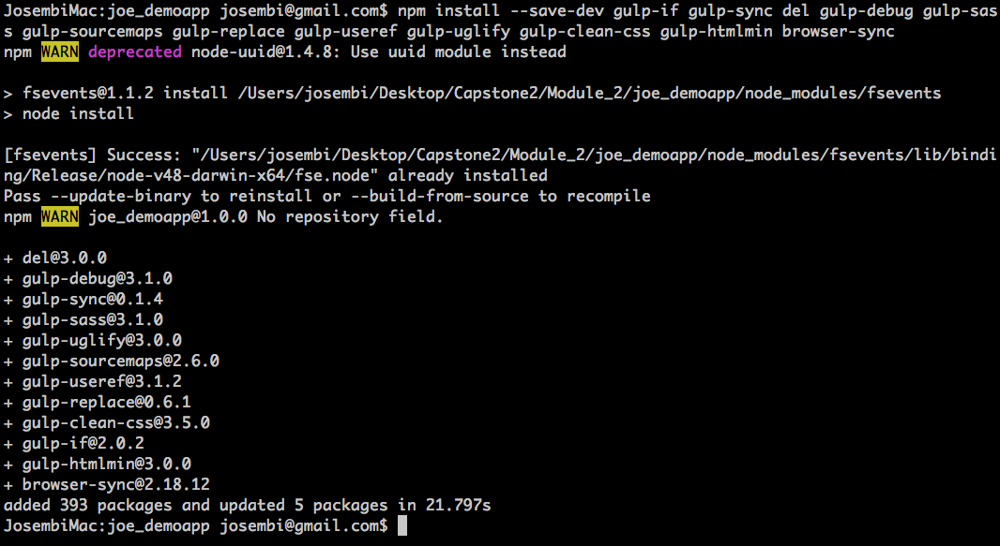
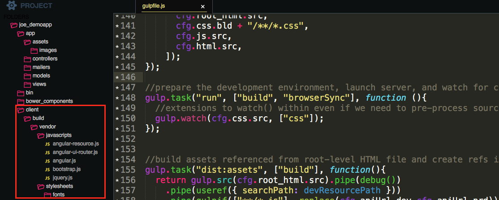
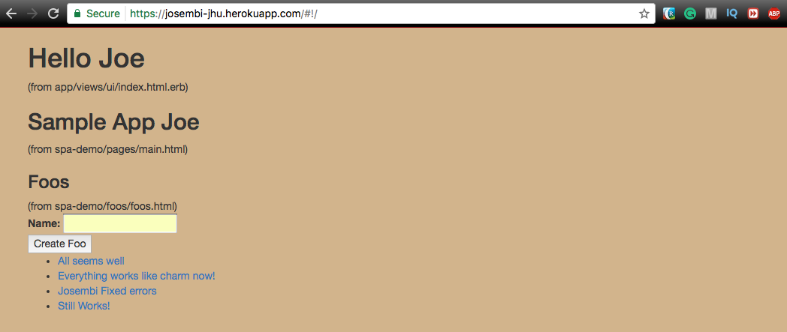

# Module 2

## Introduction
The development environment is the same as the previous module, and the focus is on the transition from development to production with Angular developed in concert with Rails. So there is much to do with Frontend Rails Server.

I'll start off with three development environments;
- **Asset pipeline**
- **External Development**
- **External development deployed to Rails using Rails as a web server** (a Hybrid of the previous two).

Even though I have the liberty to  choose only one path as far as development environment is concerned, I will be doing all three as a technical reference architecture.

## Coding Environment

```
- macOS Sierra Version 10.12.5 (Running on an iMac)

- OS X El Capitan Version 10.11.6 (Running on a Macbook Pro)
  (Using different specs eg Rails 5, Puma, etc for comparison purporses)

- Firefox (v45.7.0 ESR) ~ Extended Support Release

- ruby 2.3.1p112 (2016-04-26 revision 54768) [x86_64-darwin16]

- Rails 4.2.6

- Rails 4.2.6  (Graceful degradation from rails 5.0.2 to avoid minor errors)

- Rails-api '~>0.4', '>=0.4.0'

- Homebrew 1.1.9

- rbenv 1.1.0

- Git v2.11.1

- PostgreSQL 9.6.1

- Mongo DB version v3.4.2

- NodeJS v6.6.0

- ImageMagick 7.0.4-7 Q16 x86_64 2017-02-04

- PhantomJS v2.1.1

- Chrome Driver for selenium
  2.27.440174 (e97a722caafc2d3a8b807ee115bfb307f7d2cfd9)

- Editor: Sublime text 3

```

## Web Resources and Asset Pipeline


### Asset Pipeline Background

I've readied the API-centric server for SPA deployment (Gems, Asset directories and manifests, Server updates, HTML page updates, etc), subsequent to which I'll begin Angular modules.

I'll run a scaffold with the name of foos to implement the basic core functionalities, do migrations then log to localhost:300/foos after running the server (**rails s**).  If I view the page source, I will see the following;

```HTML

<!DOCTYPE html>
<html>
<head>
  <title>JoeDemoapp</title>
  <link rel="stylesheet" media="all" href="/assets/foos.self-e3b0c44298fc1c149afbf4c8996fb92427ae41e4649b934ca495991b7852b855.css?body=1" data-turbolinks-track="true" />
<link rel="stylesheet" media="all" href="/assets/scaffolds.self-8b5f30fd3e760e123e57cd94596052e7568bedeba69781fc5a2c86d5d0c82c43.css?body=1" data-turbolinks-track="true" />
<link rel="stylesheet" media="all" href="/assets/application.self-e80e8f2318043e8af94dddc2adad5a4f09739a8ebb323b3ab31cd71d45fd9113.css?body=1" data-turbolinks-track="true" />
  <script src="/assets/jquery.self-bd7ddd393353a8d2480a622e80342adf488fb6006d667e8b42e4c0073393abee.js?body=1" data-turbolinks-track="true"></script>
<script src="/assets/jquery_ujs.self-784a997f6726036b1993eb2217c9cb558e1cbb801c6da88105588c56f13b466a.js?body=1" data-turbolinks-track="true"></script>
<script src="/assets/turbolinks.self-1d1fddf91adc38ac2045c51f0a3e05ca97d07d24d15a4dcbf705009106489e69.js?body=1" data-turbolinks-track="true"></script>
<script src="/assets/foos.self-877aef30ae1b040ab8a3aba4e3e309a11d7f2612f44dde450b5c157aa5f95c05.js?body=1" data-turbolinks-track="true"></script>
<script src="/assets/application.self-3b8dabdc891efe46b9a144b400ad69e37d7e5876bdc39dee783419a69d7ca819.js?body=1" data-turbolinks-track="true"></script>
  <meta name="csrf-param" content="authenticity_token" />
<meta name="csrf-token" content="hOB7potp6elionqTJA+tBjTWBAoWpiKZsgDCBsWNrBHQLw6LWz35lnpgP6nwI1p6eRDeqgv0Om67+I5pONAcBA==" />
</head>
<body>

<p id="notice"></p>

<h1>Listing Foos</h1>

<table>
  <thead>
	<tr>
	  <th>Name</th>
	  <th colspan="3"></th>
	</tr>
  </thead>

  <tbody>
  </tbody>
</table>

<br>

<a href="/foos/new">New Foo</a>


</body>
</html>

```


If I ran the server in production mode (**rails s -production**) then view the page source again, it will look condensed due to the rails asset pipeline.

```HTML

<!DOCTYPE HTML PUBLIC "-//W3C//DTD HTML 4.0//EN">
<HTML>
  <HEAD><TITLE>Internal Server Error</TITLE></HEAD>
  <BODY>
	<H1>Internal Server Error</H1>
	Missing `secret_token` and `secret_key_base` for 'production' environment, set these values in `config/secrets.yml`
	<HR>
	<ADDRESS>
	 WEBrick/1.3.1 (Ruby/2.3.1/2016-04-26) at
	 localhost:3000
	</ADDRESS>
  </BODY>
</HTML>

```

The rails asset pipeline can be understood better by viewing the source code. Below is the content area of the view (**index.html.erb**) which extends the **application.html.erb** under layouts.

Notice how the application.html.erb contains a set of helper tags (**stylesheet_link_tag** & **javascript_include_tag**) which reference to the CSS and Javascript manifests?

Notice also the flags for the turbolinks and the **<%= yield %>** statement which calls the content that we write in the views? Just thought I should be explicit on that because I will mention them a lot later, and especially for the folks who download ruby applications from my repos.

The JS manifest (application.js) lists a few modules, jquery, turbolinks and a wildcard construct which I guess we won't be asked to use during the course.
The CSS manifest doesn't list anything apart from the wildcard construct.


*application.html.erb*

<hr>

*index.html.erb*

<hr>


As you may have noticed now, the aim of taking you through this FrontEnd process is to show you how in Dev mode the links you saw in the first HTML code are linked to the JS and CSS manifests.

In Prod mode, the asset links source code is compressed to enhance **Browser Asset Performance Costs**. Each HTTP/HTTPS reference in a source file requires a separate connection from browser to server; this connections are expensive. Larger contents take time to load.

Solutions for expensive connections are;
- Concatenate resources (Fewer resource files & fewer connections)
- Resources reloaded per page. (Turbolinks turns a multi-page server-side application into a pseudo single-page application)
- Address Large Contents
	* Compress JS & CSS source code
	* Leverage a Content Distribution Source (CDN) eg Cloudflare

In the case of this app, *uglifier* and *sass rails* gems are compressing my JS and CSS assets respectively. This can easily be toggled in config/environments/production.rb with the following two liners;

```ruby
  config.assets.js_compressor = :uglifier
  config.assets.css_compressor = :sass
```

I'll precompile my assets again and print out the concatenated CSS view.


<hr>


<hr>


<hr>

JS has already been concatenated but the compressed code would fill several pages if I were to include it here. The methodology is the same though.

So If the manifests were listing things, where were they getting the things they were listing? Let's hit the console.

Listing out the asset path, we see paths coming from different locations.
- The first three come from the **source/application directory**
- The next pair are under **vendor** for stuff installed locally
- The **lib** (not listed) or our own stuff to stay organised.
- The last three are from the **gems**

*Asset Pipeline in Console*


## Asset Pipeline Packaging

I'll start readying the API-centric server for SPA deployment. I won't go in depth about what I'm doing like I did in the previous topics and especially in the first tutorial, but I'll explain new material which will build from the previous one.

Here I'll touch on the Gems, Asset directories and manifests, Server updates (for pre-compiles of assets) and HTML page updates (Like the homepage that is under construction).

This will allow me to start development with Angular modules in the Frontend of the SPA.

I'll checkout to a new branch (asset-pipeline) and add gems to implement the asset pipeline.

source 'https://rubygems.org'

```ruby
gem 'rails', '4.2.6'
gem 'rails-api', '~>0.4', '>=0.4.0'
gem 'pry-rails', '~>0.3', '>=0.3.4'
gem 'rack-cors', '~>0.4', '>=0.4.0', :require => 'rack/cors'

# Gems for our assets
gem 'sass-rails', '~> 5.0', '>=3.4.22'
gem 'uglifier', '~> 3.0', '>=3.0.2'
gem 'coffee-rails', '~> 4.1', '>= 4.1.0'
gem 'jquery-rails', '~> 4.2', '>= 4.1.0'
gem 'jbuilder', '~> 2.0', '>= 2.6.0'

group :development do
	gem 'spring', '~>2.0', '>=2.0.0'
end

group :development, :test do
	gem 'webrick', '~>1.3', '>=1.3.1'
#   gem 'sqlite3', '~>1.3', '>=1.3.12'
#   gem 'pg', '0.20'
	gem 'byebug', '~>9.0', '>=9.0.6'
	gem 'rspec-rails', '~> 3.5', '>=3.5.2'
	gem 'pry-byebug', '~>3.4', '>=3.4.0'
	gem 'httparty', '~>0.14', '>=0.14.0'
end

group :production do
	gem 'rails_12factor', '~>0.0', '>= 0.0.3'

end

gem 'pg', '0.20'
gem 'puma', '~>3.6', '>=3.5.2', :platforms=>:ruby
gem 'mongoid', '~> 5.1', '>5.1.5'

# Gems for implementing Angular SPA
# https://rails-assets.org provides frictionless proxy between Bundler and Bower.
source 'https://rails-assets.org' do
	gem 'rails-assets-bootstrap', '~>3.3', '>= 3.3.7'
	gem 'rails-assets-angular', '~>1.5', '>= 1.5.8'
	gem 'rails-assets-angular-ui-router', '~>0.3', '>= 0.3.1'
	gem 'rails-assets-angular-resource', '~>1.5', '>= 1.5.8'
end
```

 We now have more paths (angular) to include in our application.


<hr>

I'll create DIRs for the stylesheets and JS assets under app/assets, then create manifest files for each.

Next I'll register them with the server to pre-compile them and make them available for us to reference. {I'll create a file, **assets.rb** in config/initializers path, and store the two manifests as arrays. *Take a peek in the application for code*}

In the console, you can see the two files translated in an array of strings.
```shell
Loading development environment (Rails 4.2.6)
[1] pry(main)> %w( spa-demo.js spa-demo.css )
=> ["spa-demo.js", "spa-demo.css"]
[2] pry(main)>
```

Our three files added.
```shell
JosembiMac:joe_demoapp josembi@gmail.com$ tree app/assets/ config/initializers
app/assets/
├── images
├── javascripts
│   └── spa-demo.js
└── stylesheets
	└── spa-demo.css
config/initializers
├── assets.rb
├── filter_parameter_logging.rb
├── secret_token.rb
└── wrap_parameters.rb

3 directories, 6 files
```

To check if all is working fine, I'll change the "under construction" on the UI view and replace it with an embedded ruby boilerplate code referencing the spa-demo manifests; let's echo an h1 of Hello.

```erb
<!DOCTYPE html>
<html lang="en">
	<head>
		<meta charset="utf-8">
		<meta http-equiv="X-UA-compatible" content="ie=edge, chrome=1">
		<meta name="viewport" content="width=device-width, initial-scale=1">
		<%= stylesheet_link_tag "spa-demo", :media => "all" %>
		<%= javascript_include_tag "spa-demo" %>
	</head>
	<body>
			<div class="container">
				<h1>Hello</h1>
				<span>(from app/views/ui/index.html.erb)</span>
			</div>
	</body>
</html>
```

My localhost is showing the UI correctly.

<hr>

The source file from my localhost is linking to my manifest files correctly as expected.


```HTML
<!DOCTYPE html>
<html lang="en">
	<head>
		<meta charset="utf-8">
		<meta http-equiv="X-UA-compatible" content="ie=edge, chrome=1">
		<meta name="viewport" content="width=device-width, initial-scale=1">
		<link rel="stylesheet" media="all" href="/assets/spa-demo.self-9ad9eaaba8b4b6e18301e558f0123c9a24b7103b282b518b0843ac3e4973db77.css?body=1" />
		<script src="/assets/spa-demo.self-d8a46cfe42f3ef5341495e8ac3b418bd2dc954dc8a7bcfe884bbb23fe57d69c0.js?body=1"></script>
	</head>
	<body>
			<div class="container">
				<h1>Hello</h1>
				<span>(from app/views/ui/index.html.erb)</span>
			</div>
	</body>
</html>
```

At this point, I'm sure that my asset DIR is created correctly, the manifest files are referencing correctly from the **asset.rb** file within the **initializers** folder and the html file is also referencing correctly the manifests using the CSS and JS tags.

Awesome! I'll add data (eg *require bootstrap*, *require jquery*, etc) in the manifest files (*navigate to see code in the app*) and the source is referenced accordingly.


```HTML
<!DOCTYPE html>
<html lang="en">
	<head>
		<meta charset="utf-8">
		<meta http-equiv="X-UA-compatible" content="ie=edge, chrome=1">
		<meta name="viewport" content="width=device-width, initial-scale=1">
		<link rel="stylesheet" media="all" href="/assets/bootstrap.self-96a1cbefba2066f7a3e85de9a655597a65e7514c6fa4c3168e6b2d7dd3bc9b77.css?body=1" />
<link rel="stylesheet" media="all" href="/assets/spa-demo.self-a83dbd88eb86e6627c720c95c1cbe134c9b69cdb8fe01361b59e4c71f2dea67c.css?body=1" />
		<script src="/assets/jquery2.self-25ca496239ae8641a09627c8aace5863e7676e465fbb4ce81bc7eb78c4d15627.js?body=1"></script>
<script src="/assets/bootstrap/bootstrap.self-b38817c3e3a3049abb1fc08dd6ae448b23330f8453226efdb074710209474f75.js?body=1"></script>
<script src="/assets/bootstrap.self-e3b0c44298fc1c149afbf4c8996fb92427ae41e4649b934ca495991b7852b855.js?body=1"></script>
<script src="/assets/angular/angular.self-cbf63dfe20595c76ecb6316dfb062fd913b424590ff80a8c5ada4bd82672b703.js?body=1"></script>
<script src="/assets/angular.self-e3b0c44298fc1c149afbf4c8996fb92427ae41e4649b934ca495991b7852b855.js?body=1"></script>
<script src="/assets/angular-ui-router/angular-ui-router.self-8d1a567702decda3c48178b8db54b5b9dbe23f0f7b137aca5d7f2fa843efc7e1.js?body=1"></script>
<script src="/assets/angular-ui-router.self-e3b0c44298fc1c149afbf4c8996fb92427ae41e4649b934ca495991b7852b855.js?body=1"></script>
<script src="/assets/angular-resource/angular-resource.self-7cce3b8707c34fb59333dba5b82c7f6668fe3a0d75b285f65421c851161aae02.js?body=1"></script>
<script src="/assets/angular-resource.self-e3b0c44298fc1c149afbf4c8996fb92427ae41e4649b934ca495991b7852b855.js?body=1"></script>
<script src="/assets/spa-demo.self-29493403fb85d1b36bde5cadef5f763bc498e1ed4a2fa791065972f55d74712f.js?body=1"></script>
	</head>
	<body>
			<div class="container">
				<h1>Hello</h1>
				<span>(from app/views/ui/index.html.erb)</span>
			</div>
	</body>
</html>
```

All the resources needed are in place and it's now possible to start defining the angular application.

I'll add the angularJS directives within the UI index.html.erb file (*search code in the app*) then run the browser console to make sure it throws an error. This will ascertain that the angular libraries are being found.

Cool! isn't it?

<hr>

## Asset Pipeline Deployment

I will be deploying my skeleton SPA and see how it behaves and if everything works as I expect.

After deployment, everything works as expected.

See [link](https://josembi-jhu.herokuapp.com/). The previous UI in module 1 has been overwritten :-(. As you can see, the asset pipeline not only gave us the opportunity to deploy, but it also performed a lot of automated optimizations.


# External SPA Packaging with Gulp

Next I'll do some Web Client Development outside of Rails Asset Pipeline (RAP). This kind of development is commonly called **external development**.

One of many Web Client Environments include;
* Node Package Manager
* Bower
* Gulp tasks etc

What I'll do is code externally without using RAP with the goal of reaching the same state as I did with RAP or Ruby. My aim it to nail this approach and create an alternative so I don't get too watered down on a single approach.

## External Web Client Packaging with Gulp

As previously reiterated, I'll focus the Rails' backend on the API and the SPA application on delivering the browser experience. The two will communicate via web services; however, I have options on how I can package that.

- Option 1; Using RAP. I can take the web client and package it within the Asset Pipeline, communicating through web services the API code running on the Rails server. This is easy as it provides us with a single source tree and a single deployment.

- Option 2; External Deployment. Ideal for complex web clients. I have the option of creating a separate application with different module dependencies and whatnot, then deploy in alternative environments like GitHub and leave Rails to deploy only the API code.

- Option 3; External Deployment in Public. This is an in-between alternative where all independent development is done on the web client and later use Rails' web server as a web server and deploy our distribution artifact to the public directory.


<hr>

As I diversify to become versatile, I'll do away with Option 1 for now. (No Gems [*dependencies, package capabilities*], No Bundler, No Asset Pipeline [*Concatenation, minimization, Profiles*], etc). I go Manual. I'll need to manage my library dependencies, versions, etc.

There are so many Web Client Development Tools floating around; one of my favourites sometimes back was <a href="https://www.coursera.org/account/accomplishments/certificate/BCDAVFCZ7ABF">MeteorJS</a> which works favourably well in [Responsive Web Design](https://www.coursera.org/account/accomplishments/certificate/5SB7XUBKN3LN) with a NoSQL DB like [Mongo](https://www.coursera.org/account/accomplishments/certificate/5WN2K4AFU6B8). I'll be using Gulp, just to be in synch with what is in the course material. If I deviate, I will give a heads up.

**Gulp Tasks** is based on:
- Node Package Manager
	- part of NodeJS
	- Manages low level packages like Bower, Gulp & Gulp Tasks
- Bower Package Manager
	- Manages higher-level packages like ngular, Bootstrap, etc.

Anyway, sorry for the boredom with too much details. I'll grab a cup of coffee and get to coding momentarily ...

## Gulp Development Setup

Before I do anything, I'll create a build tree and add it to **.gitignore** that way it wont be commited to git, this is just to control what is added to git and what is not. I really dont want my Source and Buid Trees to be pushed to GitHub or Heroku, what I do and can allow to go public is the Distribution Tree.

## Gulp installation

Firstly, I'll initialise npm which will give us a JSON package.


<hr>

Next, I'l install Bower, which will enable me to access high-level assets like angular, etc. Warnings are not errors especially deprecate ones, so wink and carry on.


<hr>

Bower had issues instantiating and had to run it on a global scope and export my $PATH. I then instantiated it with the defaults. See instantiation below and notice **bower** and **package** json files.


<hr>

Subsequent to instantiating Bower, I installed the artefacts/dependancies that I will need.


<hr>

Dependencies installed
```shell
JosembiMac:joe_demoapp josembi@gmail.com$ du -h -d 1 bower_components
1.9M    bower_components/angular
 80K    bower_components/angular-resource
1.8M    bower_components/angular-ui-router
904K    bower_components/bootstrap-sass
1.5M    bower_components/jquery
376K    bower_components/jquery2
6.6M    bower_components
JosembiMac:joe_demoapp josembi@gmail.com$ ls bower_components/angular
LICENSE.md      angular.js      angular.min.js.map  package.json
README.md       angular.min.js      bower.json
angular-csp.css     angular.min.js.gzip index.js
JosembiMac:joe_demoapp josembi@gmail.com$
```

I then installed gulp, which took away 4 to 5 minutes of my life, I updated to graceful-fs@^4.0.0 and created a lockfile as package-lock.json which I commited to git. Bash output is too long to show here but a nice tree within my application showing gulp, dependencies and versions can be seen below.
**node_modules** has a tonne of dependencies which can be experimented when you run your own build.


<hr>

Time now to install **Gulp Tasks (GT)**. The GT used are;

* Flow Control
	- gulp-if
	- gulp-sync
* Build Tools
	- del
	- gulp-debug
	- gulp-sass
	- gulp-sourcemaps
	-gulp-replace
* Minification
	- gulp-useref
	- gulp-uglify
	- gulp-clean-css
	- gulp-htmlmin
* Runtime Tools
	- browser-sync

I just can't go through each of this as it would take a fair amount of time but within the context of the overall build, it's quite intuitive seen it in action. I'll drop a one-liner and install everything at once.


<hr>
That was both painful and elegant at the same time, took away 6 minutes or so of my life, but was successful.


## GT Basics

Within the root of my app, I'll create a Javascript file and name it **gulp.js**. I'll use *strict* for JS and create a gulp object to require gulp. Subsequent to that I'll create gulp tasks like *hello* and *world* and print it out in Bash/Terminal.

```javascript
"use strict";

var gulp = require('gulp');

gulp.task("hello", function() {
  console.log("hello");
});

gulp.task("world", function() {
  console.log("world");
});

gulp.task("default", ["world"] );

```

I had an error thrown when I ran *gulp hello*; to work around that I had to install gulp globally and update my npm dependencies.


<hr>

At this point I did away with the hello world test task and defined dependencies between tasks within the gulp.js file.


```javascript
"use strict";

var gulp = require('gulp');

//gulp flow control
var gulpif = require('gulp-if');
var sync = require('gulp-sync')(gulp);
//build tools
var del = require('del');
var debug = require('gulp-debug');
var sass = require('gulp-sass');
var sourcemaps = require('gulp-sourcemaps');
var replace = require('gulp-replace');
//dist minification
var useref = require('gulp-useref');
var uglify = require('gulp-uglify');
var cssMin = require('gulp-clean-css');
var htmlMin = require('gulp-htmlmin');
//runtime tools
var browserSync = require('browser-sync').create();
```
<hr>

## Gulpfile Definitions

I'll start by adding some dir definitions within the gulfile.js client dir (client dir at the root of rails). The client dir will start with client source (manage app source) and client build (manage intermediate files).
Vendor will manage other files, for instance those coming from bower repo. I'll stash the distribution path within the public line whilst bowerPath will fetch components that I installed earlier like jQuery, Bootstrap, Angulat, etc

```javascript
//where we place out source code
var srcPath =  "client/src";  
//where any processed code or vendor files gets placed for use in development
var buildPath = "client/build";
//location to place vendor files for use in development
var vendorBuildPath = buildPath + "/vendor";
//where the final web application is placed
var distPath = "public/client";
//location of our vendor packages
var bowerPath = "bower_components";
```
<hr>

Next I'll declare a top level hash for config and declare a couple of locations. My locations as you may have intuitively surmised are four. My *root html (index)*, *CSS*, *JS* and *html*. The construct (**"!"+srcPath**) within the last glob of my location declaration will ignore files within the root dir which will be managed by *root_html*.

After compiling the CSS manifests into a single file, it will be dropped in the build path and dir beneath that */stylesheets*.

My vendor files will be coming from bootstrap_sass, bootstrap_fonts, jQuery, angular and all the other dependencies I dropped in bash. Some globs are pointing to specific files e.g  angular-ui-router.js while others are pointing to a series of files eg bootstrap-sass/assets/fonts/**/\*.

I've also created some definitions relative to the build location for vendor files and locations where to find them both locally and remotely.

I then defined a variable (*devResourcePath*) for my development web server to serve up resources in a priority order.

```javascript
var cfg={
  //our client application source code src globs and build paths
  root_html : { src: srcPath + "/index.html",   bld: buildPath },
  css :       { src: srcPath + "/stylesheets/**/*.css", bld: buildPath + "/stylesheets" },
  js :        { src: srcPath + "/javascripts/**/*.js" },
  html :      { src: [srcPath + "/**/*.html", "!"+srcPath + "/*.html"]},

  //vendor css src globs
  bootstrap_sass:     { src: bowerPath + "/bootstrap-sass/assets/stylesheets/" },

  //vendor fonts src globs
  bootstrap_fonts:   { src: bowerPath + "/bootstrap-sass/assets/fonts/**/*" },

  //vendor js src globs
  jquery:            { src: bowerPath + "/jquery2/jquery.js" },
  bootstrap_js:      { src: bowerPath + "/bootstrap-sass/assets/javascripts/bootstrap.js" },
  angular:           { src: bowerPath + "/angular/angular.js" },
  angular_ui_router: { src: bowerPath + "/angular-ui-router/release/angular-ui-router.js" },
  angular_resource:  { src: bowerPath + "/angular-resource/angular-resource.js" },   

  //vendor build locations
  vendor_js :    { bld: vendorBuildPath + "/javascripts" },
  vendor_css :   { bld: vendorBuildPath + "/stylesheets" },
  vendor_fonts : { bld: vendorBuildPath + "/stylesheets/fonts" },

  apiUrl: { dev: "http://localhost:3000",
			prod: "https://josembi-jhu.herokuapp.com/"},
};

//files within these paths will be served as root-level resources in this priority order
	var devResourcePath = [
		cfg.vendor_js.bld,
		cfg.vendor_css.bld,
		buildPath+"/javascripts",
		buildPath+"/stylesheets",
		srcPath,
		srcPath+"/javascripts",
		srcPath+"/stylesheets",
		];  

```
<hr>

In a nutshell, I went through some data definitions that structured my Build which will give our task pointers to source dir's, build dir's and distribution dir's.

## Gulp Build Tasks

I'll be creating tasks that are focused on building and cleaning artifacts from vendor repo into the app build tree.

For starters I'll test the build using a console.log and run the build in bash.

```javascript
gulp.task("clean:build", function() {
	console.log("buildPath" + buildPath);
  return del(buildPath);
});
```


<hr>

I have added more tasks which will process and compile SASS, jQuery, Bootstrap etc. After compiling, I want my files to be placed within the build area.

```javascript
//remove all files below the build area
gulp.task("clean:build", function() {
  return del(buildPath);
});

//remove all files below the dist area
gulp.task("clean:dist", function() {
  return del(distPath);
});

//remove all files below both the build and dist area
gulp.task("clean", ["clean:build", "clean:dist"]);


//place vendor css files in build area
gulp.task("vendor_css", function(){
  return gulp.src([
          //cfg.bootstrap_css.src,
        ])
        .pipe(gulp.dest(cfg.vendor_css.bld));
});

//place vendor js files in build area
gulp.task("vendor_js", function(){
  return gulp.src([
          cfg.jquery.src,
          cfg.bootstrap_js.src,
          cfg.angular.src,
          cfg.angular_ui_router.src,
          cfg.angular_resource.src,
        ])
        .pipe(gulp.dest(cfg.vendor_js.bld));
});

//place vendor font files in build area
gulp.task('vendor_fonts', function() {
  //access the following font files
  return gulp.src([
          cfg.bootstrap_fonts.src,
      ])
      .pipe(gulp.dest(cfg.vendor_fonts.bld));
});

gulp.task('css', function() {
  return gulp.src(cfg.css.src).pipe(debug())
      .pipe(sourcemaps.init())
      .pipe(sass({ includePaths: [cfg.bootstrap_sass.src] }))
      .pipe(sourcemaps.write("./maps"))
      .pipe(gulp.dest(cfg.css.bld)).pipe(debug());
});

//prepare the development area
gulp.task("build", sync.sync(["clean:build", ["vendor_css", "vendor_js", "vendor_fonts", "css"]]));


//helper method to launch server and to watch for changes
function browserSyncInit(baseDir, watchFiles) {
  browserSync.instance = browserSync.init(watchFiles, {
    server: { baseDir: baseDir },
    port:   8080,
    ui:     { port: 8090 }
  });
};

//run the browser against the development/build area and watch files being edited
gulp.task("browserSync", ["build"], function() {
  browserSyncInit(devResourcePath,[
      cfg.root_html.src,
      cfg.css.bld + "/**/*.css",
      cfg.js.src,
      cfg.html.src,
    ]);
});

//prepare the development environment, launch server, and watch for changes
gulp.task("run", ["build", "browserSync"], function (){
  //extensions to watch() within even if we need to pre-process source code
  gulp.watch(cfg.css.src, ["css"]);
});


//build assets referenced from root-level HTML file and create refs in HTML file
gulp.task("dist:assets", ["build"], function(){
  return gulp.src(cfg.root_html.src).pipe(debug())
    .pipe(useref({ searchPath: devResourcePath }))
    .pipe(gulpif(["**/*.js"], replace(cfg.apiUrl.dev,cfg.apiUrl.prd))) //change URLs
    .pipe(gulpif(["**/*.js"], uglify()))  //minify JS
    .pipe(gulpif(["**/*.css"], cssMin())) //minify CSS
    .pipe(gulp.dest(distPath)).pipe(debug());
});

//build/copy over font resources into dist tree
gulp.task("dist:fonts", function(){
  return gulp.src(cfg.vendor_fonts.bld + "/**/*", {base: cfg.vendor_css.bld})
    .pipe(gulp.dest(distPath));
});

//build/copy over HTML resources into dist tree
gulp.task("dist:html", function(){
  return gulp.src(cfg.html.src, {base: srcPath+"/javascripts"}).pipe(debug())
    .pipe(htmlMin({collapseWhitespace: true})) //minify HTML
    .pipe(gulp.dest(distPath)).pipe(debug());
});

//build all dist artifacts ready for deployment
gulp.task("dist", sync.sync(["clean:dist","build", "dist:assets", "dist:fonts", "dist:html"]));

//execute the dist webapp in a web server
gulp.task("dist:run", ["dist"], function() {
  browserSyncInit(distPath);
});


//default task will build the development area and launch the browser
gulp.task("default", ["run"]);
```

I'll instantiate the build command and it should add folders and files within the client dir of my app root.


<hr>

You can see below my dir hierarchy within my client and a tree printout in bash.


<hr>

I'm happy that CSS/SASS and JS files are being saved in their respective folders. :-)


<hr>

Another thing I would like to confirm is whether the compiler is working. If I run **gulp css** it will grab the source file but won't output anything unless I create the stylesheets source folders.


<hr>

Let me get that out of the way by creating src folder and a file (**spa-demo.css**) and a CSS manifest to import bootstrap.

As you can see below, the compilation will be successful this time round. On the left is my dev text editor and on the right is my terminal/bash.


<hr>

Gulp is asyncronous and thus it runs it's dependencies in parallel. I have altered that to ensure clean build is implemented first to avoid conflicts.

If I do **gulp clean**, then everything should be removed from my client folders and ready to be regenerated in my next application.


<hr>

At this point my tasks (CSS, JS, Fonts, SASS) are ready and my Clean (Build tree, Distribution tree) is implemented. My aggregate build works well both serially & parallelly.

## Gulp Development Runtime Tasks

In this section I'l start serving content from the build tree. I'll set up browser synch, have it serve content from a series of directories and watch a subset of those for changes.

By the time I'm done I want to show that Angular is well set and ready to go inside of my build area.

I'll start by creating an **index.html** within the client src directory which will be my manifest. The comments will act as an aid in concatenation whilst switching between distribution and build environments.


```html
<!DOCTYPE html>
<html lang="en" ng-app="spa-demo">
  <head>
    <meta charset="utf-8">
    <meta http-equiv="X-UA-Compatible" content="IE=Edge,chrome=1">
    <meta name="viewport" content="width=device-width, initial-scale=1.0">

    <!-- build:css client-assets/styles.css -->
    <link rel="stylesheet" type="text/css" href="spa-demo.css">
    <!-- endbuild -->

    <!-- build:js client-assets/scripts.js -->
    <script src='jquery.js'></script>
    <script src='bootstrap.js'></script>
    <script src='angular.js'></script>
    <script src='angular-ui-router.js'></script>
    <script src='angular-resource.js'></script>

    <script src='spa-demo/app.module.js'></script>
    <script src='spa-demo/app.router.js'></script>
    <script src='spa-demo/app.constant.js'></script>   

    <script src='spa-demo/foos/foos.module.js'></script>
    <script src='spa-demo/foos/foos.service.js'></script>
    <script src='spa-demo/foos/foos.controller.js'></script>
    <script src='spa-demo/foos/foos.directive.js'></script>
    <!-- endbuild -->
  </head>
  <body>

    <div class="container">
      <h1>Hello</h1>
      <span>(from client/src/index.html)</span>
      <div ui-view></div>
    </div>

    <button type="button" class="btn btn-default" aria-label="Left Align">
      <span class="glyphicon glyphicon-align-left" aria-hidden="true"></span>
    </button>

    <button type="button" class="btn btn-default btn-lg">
      <span class="glyphicon glyphicon-star" aria-hidden="true"></span> Star
    </button>

  </body>
</html>

```

I'll use browser synch (already defines in gulp.js) to call the fn which will supply the data resource path.I'll serve up on port 8080 and use port 8090 to view using browser sync.

The aggregate task will have a dependency on build and it will run the browser sync task in parallel. If my CSS source changes, then the additional watch *(gulp.watch(cfg.css.src, ["css"])* will re-serve the info.

After instantiating gulp, browser sync launces automatically at *localhost:8080* as specified within the browser sync fn initialisation in gulp.js, no errors thrown just amazing. I am cooking with gas :-).

```javascript
function browserSyncInit(baseDir, watchFiles) {
  browserSync.instance = browserSync.init(watchFiles, {
    server: { baseDir: baseDir },
    port:   8080,
    ui:     { port: 8090 }
  });
};
```


<hr>

If we inspect the page with the console, we'll realise that dependency injection from Angular is not working. Modules, controllers and whatnot need to be defined and configured.


<hr>

## Gulp Distribution Tasks (GDT)

I'll be setting up GDT which will replace what the ASA Pipeline does when I switch from development to production. I'll target Concatenation, Minification and the overall Application Assembly. The distribution tree is what I'll deploy to production.

* Distribution Tasks
	- Concatenation
	- Minification
	- Application Assembly

The distribution (dist) task *(gulp.task("dist", sync.sync(["clean:dist","build", "dist:assets", "dist:fonts", "dist:html"]));)* will take care of things syncronously (clean dist, built, assets etc).

The browser sync will then be run against my deployment using the distribution path, where the files are.

```javascript
gulp.task("dist:run", ["dist"], function() {
  browserSyncInit(distPath);
});
```

If I go to my dev area and do a distribution run, my server will be up and pointing at my distribution area.


<hr>

The dist' page won't be updated by browser synch because it's not watched in *gulp.js*. However important to note (I wont paste here the code) is that the page's css and js manifests are concatenated and compressed. The uglified code loads faster.

So I'm good here with two environment capabilities to Asset Pipeline. I have build and distribution environments just as in tutorial one where I had development and production instances.

## External Web Client Deployment

In this section I will be deploying my external web client to the internet.
I'll push my gulp branch to GitHub and display it on GitHub pages. However there exists a caveat. If I were to do this in real life I would need two source trees but I'll keep things in a common source tree for my code to stay intact.

I'll create a GitHub gh-pages and deploy there.

You can see my deployment below;


<hr>

The url that is serving my page at github.io can easily fetch index.html from the client.

https://awt12.github.io/spa-demo-module2/public/client/index.html

Cool! Now i have my page configured externally and it's working remotely in github pages. The Backend works marvellously but the Frontend needs work. Remember that Angular libraries are not well configured like I said previously when I added console source files with dependency injection errors.

If I view the source file gulp from [github](https://awt12.github.io/spa-demo-module2/public/client/index.html) I see my deployment optimized service deployed.

```html
<!DOCTYPE html>
<html lang="en" ng-app="spa-demo">
  <head>
    <meta charset="utf-8">
    <meta http-equiv="X-UA-Compatible" content="IE=Edge,chrome=1">
    <meta name="viewport" content="width=device-width, initial-scale=1.0">

    <link rel="stylesheet" href="client-assets/styles.css">

    <script src="client-assets/scripts.js"></script>
  </head>
  <body>

    <div class="container">
      <h1>Hello Joe</h1>

      <span>(from client/src/index.html)</span>
      <div ui-view></div>
    </div>

    <button type="button" class="btn btn-default" aria-label="Left Align">
      <span class="glyphicon glyphicon-align-left" aria-hidden="true"></span>
    </button>

    <button type="button" class="btn btn-default btn-lg">
      <span class="glyphicon glyphicon-star" aria-hidden="true"></span> Star
    </button>

  </body>
</html>
```

Likewise, if I view my [heroku](https://josembi-jhu.herokuapp.com/) deployment, I see the Asset Pipeline of the equivalent.


```html
<!DOCTYPE html>
<html lang="en" data-ng-app="spa-demo">
    <head>
        <meta charset="utf-8">
        <meta http-equiv="X-UA-compatible" content="ie=edge, chrome=1">
        <meta name="viewport" content="width=device-width, initial-scale=1">
        <link rel="stylesheet" media="all" href="/assets/spa-demo-7e217a8098e1438e221004b35fcc2d8cfc4566a43f2647a11512bd88797a6d93.css" />
        <script src="/assets/spa-demo-ffdef5152ec9d4f6f5f19e4abbab0ac1db34103a9220f4f79a7bb49ef00addd6.js"></script>
    </head>
    <body>
			<div class="container">
				<h1>Hello</h1>
				<span>(from app/views/ui/index.html.erb)</span>
				<div data-ui-view></div>
			</div>
    </body>
</html>
```

See how the CSS and JS manifests differ? See also how the js and css files have been uglified?
* Github deployment; [CSS](https://awt12.github.io/spa-demo-module2/public/client/client-assets/styles.css), [JS](https://awt12.github.io/spa-demo-module2/public/client/client-assets/scripts.js)

<hr>

* Heroku deployment; [CSS](https://josembi-jhu.herokuapp.com/assets/spa-demo-7e217a8098e1438e221004b35fcc2d8cfc4566a43f2647a11512bd88797a6d93.css), [JS](https://josembi-jhu.herokuapp.com/assets/spa-demo-ffdef5152ec9d4f6f5f19e4abbab0ac1db34103a9220f4f79a7bb49ef00addd6.js)

## External Web Client Rails Packaging

Supposing I wanted to take the hybrid approach? That is take the external web client and deploy it along with my Rails server to Heroku? Which in my opinion is the best option from a feature and management standpoint.

So I will be deploying my external web client to public and make it accessible from root URL. What will happen now is that I'll clean my gulp environment and run a new distribution.


<hr>

Notice how html custom error message redirects have been added on my public folder?


<hr>

Next I'll boot puma and as it loads I'll brew a cup of espresso to jump start my mental faculties (YES! I've just woken up :-).

If I go to localhost:3000, I'll get my "under construction page" been served up by Rails. If I go to localhost3000/client, I'l access my distribution client that I deployed to Github.


<hr>

So I have my external web application been deployed and serviced by Rails as a web server. What I need to do now is solve the resource issue so that the client-assets like scripts.js are found by the URL. I've added a redirect rout in routers.rb to sort out that.

It's time to get greedy. At the root of the app, I have my "under construction page" but my Heroku deployment that contains my Asset Pipeline implementation is serving up the web app from the asset pipeline. I need something similar.

Within my app UI controller, I'll add an index method with a redirect to client/index.html

If I go to my localhost client and inspect traffic, I see there is a temporary redirect. It can't quite find what is needed but it's aware of that (*304 Not Modified*). It's the client's task to display stuff from cache so the proxy has no worries.

*Examining the network*

<hr>

*Status code of 304 Not Modified*

<hr>

*Redirect to index.html via the routes with a successful request (200 OK)*

<hr>

In a nutshell, I successfully used Rails as a web server and used it to access my external web application as if it were part of rails. I also configured my routers and Controller (UI) for redirects and touched lightly on re-direct types.

## External Web Client Rails Deployment

I will be deploying the external web client within Rails to Heroku. At this point I'll just deploy my git local branch to my staging Heroku remote branch which will overwrite my previous work. (I'll leave a screenshot)

I ran on git merge issues whilst deploying but I sorted that out by forcing the deployment (not advisable on a real project) on my remote staging branch because it serves the purpose of deployment and NOT sharing with DevOps which can really cause merge nightmares.

Unfortunately I can't use my professional paid account as it may expose sensitive data but the free one with limitations is more than enough to play around.

After deploying to Heroku and going to the root, I got my 304 as expected.


<hr>

Now that I have all the infrastructure in place with multiple options, I will get to the SPA application.

# SPA APPLICATION

## Merging UI Branches

I will be merging the Asset pipeline, External Web Client and External Web Client Deployed to Rails branches. This will provide a single branch capable of concurrently working with all three approaches.

Firstly, I'll merge the asset pipeline and the external rails branches to master. I didn't make lot's of commits in this project but I'm sure there will be some merge issues. Currently, this is how my commit tree looks like.


<hr>

I solved conflicting issues when merging the branches and my local host is working correctly. Running gulp will trigger browser synch to initialise my localhost at port 8080 and that will actually run in concert with Rails.

Successfully merged asset-pipeline branch to ap_external.

<hr>

I wouldn't like to leave the ap_external branch on it's own like that, so I'll go ahead and merge it to master. Hopefully no conflicts will arise now.


<hr>


<hr>

That went smoothly, so I can now delete the branch without hassles as it's not representing a fork. I'll now create a new branch for my Single Page Application (SPA) development.

## SPA Application Module

Like in course five, I'll start building an Angular application. I won't dwell much explaining stuff like I did in gulp (which was a new tech), so I'll just dive in and code without getting into details.

I will be looking at;
* Creating a basic Angular application
	* Angular application/Root module.
	* Constant component
	* Config component (UI-Router)
		- Single state
	* One HTML page
* ERB Files
* Javascript manifest

My application will reside within a folder (spa-demo) in the app/assets/javascripts path. The SPA page will reside in  app/assets/javascripts/spa-demo/pages.

I've created the first module (spa-demo) with a dependency of "ui.router" which I've declared within an IIFE for it to stay global.

```javascript
(function() {
  "use strict";

  angular
    .module("spa-demo", [
    "ui.router",
    ]);
})();

```

I've created a page (main.html) with basic HTML in pages folder as well. I'll create (in root) a file for constants which I will rectify when doing refactoring whilst addressing problems which I expect to arise. (**app.constant.js.erb**) {Notice anything unique? The extension => processed as a pipeline}

```javascript
(function() {
  "use strict";

  angular
    .module("spa-demo")
    .constant("spa-demo.APP_CONFIG", {
      main_page_html: "<%= asset_path('spa-demo/pages/main.html') %>"
      <!--Unaona the asset path function? Good!-->
    });

})();
```

I've added another constant file within spa-demo folder in the external client side without erb tags. This is to be consistent with the asset pipeline approach.  

I'll add a router file within the spa-demo asset pipeline, henceforth AP. I'll be injecting stateProvider, urlRouterProvider & spa-demo.config.APP_CONFIG (To point at HTML page). I'll use a technique that's verbose in naming components to accompany their modules. (At least it's clear where stuff is coming from).

```javascript
(function() {
  "use strict";

  angular
    .module("spa-demo")
    .config(RouterFunction);

  RouterFunction.$inject = ["$stateProvider",
                            "$urlRouterProvider",
                            "spa-demo.config.APP_CONFIG"];

  function RouterFunction($stateProvider, $urlRouterProvider, APP_CONFIG) {
    $stateProvider
    .state("home",{
      url: "/subjects",
      templateUrl: APP_CONFIG.subjects_page_html
    })


        $urlRouterProvider.otherwise("/subjects");
  }
})();
```

I'll require the router, module and constant app files within the spa-demo.js for angular to work. Reloading the browser, errors were been thrown due to angular connectivity issues with it's libraries but had to fix that from the UI controller redirect route that I had declared in the index fn.

Et voila. No errors in console, life is good again.

<hr>

## SPA Application Module External Packaging

I will carry on and delve in the external environment of my application, touching on both the build and the distribution. I will then use gulp to further test it's functionalities.

On the client side, I've added similar files as the asset pipeline's spa-demo, with minor tweaks, nothing new. If I run gulp now, browser-synch will run successfully but if I inspect the page, in config it fails to inject Angular dependencies. To solve, I've declared my JS file right inside the HTML file and that solved the error and displayed my low level page.

```html
...........
    <script src='spa-demo/app.module.js'></script>
    <script src='spa-demo/app.router.js'></script>
    <script src='spa-demo/app.constant.js'></script>  
...........
```

I've now run the **gulp dist** command to create a distribuition area. Had some issues again with dependencies but tweaked some minor tasks in gulp.js and crisis was averted. "Note to self; Experimenting with code sometimes sorts out some errors".

At this point, External is working, Distribution is working and so is Rails.


<hr>

One thing to point out with the distribution page is the concatenation of JS with the vendor stuff (you can check the source code {warning: it's uglified}). Later if we want we can add stuff in a minified concatenated form.

# Angular/Rails Communications

Simply put, I will be making the Frontend communicate with the Backend.

## Sample Resource CRUD Module.

I'll be going through;
* Adding UI access to foo resources  
	- Start with the foos module
* Updating manifests
	- Asset Pipeline
	- External
* Defining the location of the API server

I'll create a new branch and kick start rails server. I love developing from bottom-up (bear with me) so I'll start with Configs. Within the app.constant.js.erb, I'll add an environment variable for the server url, and will mirror the same thing at the external env (client). The line of code is shown below with the hash rocket. At the external env, the code will be a localhost:3000 which will sub the environment variable. So now I've added where to contact the API, lemmie get rolling....

```javascript
(function() {
  "use strict";

  angular
    .module("spa-demo")
    .constant("spa-demo.APP_CONFIG", {
    	server_url: "<%= ENV['RAILS_API_URL'] %>", /*  <= this one for rails */
    /*	server_url: "http://localhost:3000",   <= this one for external env */

      main_page_html: "<%= asset_path('spa-demo/pages/main.html') %>"
    });

})();
```

In Rails (whenever I say this, envision rails asset pipeline environment), under spa-demo, I'll add a folder (foo) and inside foo a file (**foos.module.js**) with the following module and dependency;

```javascript
(function() {
  "use strict";

  angular
    .module("spa-demo.foos", [
      "ngResource"
    ]);
})();
```

I'll then require the foos file in spa-demo.js manifest and the external (whenever I say this, envision client, the hybrid in angular) **index.html** file. No errors (yet) after refreshing page. (A programmers dream :-). So a minor start here, and because angular was very well tackled in course 5, I won't go in depth or add lines and lines of codes.

## Sample Resource Service Skeleton

I'll be going through;

* Sample Resource Service. (communication with the backend Rails server for the Angular application)
* ngResource (Provides a REST based interface above the HTTP service)
* Angular factory

At this point, I have my backend Rail server and the set-up of Angular app. When the user navigates to a page with certain elements, eg *sd-foos*, angular will try to locate them in directives eg *foosVM*. The directive will then declare an HTML template and a controller. The controller with data and call-backs will rely on the service into the controller (Rails) when instantiated.

The controller will make use of the service (my case foo service) in order to access data in the backend managed with Rails. If successful, a call response to the controller is made triggering a view model with data fetched.


<hr>

I'll add a service to contact the backend API server. (I'll use a factory as you can see below, code is pretty readable, no need to go through it). Before I get carried away, I'll add the service in the spa-demo.js manifest (Rails) and Client.

```javascript
(function() {
  "use strict";

  angular
    .module("spa-demo.foos")
    .factory("spa-demo.foos.Foo", FooFactory);

  FooFactory.$inject = ["$resource", "spa-demo.config.APP_CONFIG"];
  function FooFactory($resource, APP_CONFIG) {
    return $resource(APP_CONFIG.server_url + "/api/foos/:id",
      { id: '@id'},
      {
        update: { method: "PUT" }
      }
      );
  }

  }  
})();

```


## Sample Resource CRUD Controller Skeleton

I will be going through a Sample Resource Crud Controller which will be dropped in the Rails backend by Foo service and injected in the Foo Controller. The controller will process the View. (Remember MVC?)


<hr>

I'll create a foo's controller in Rails and add a skeleton code with modules and CRUD functions. I'll update the manifest as well otherwise things will break.

```javascript
(function() {
  "use strict";

  angular
    .module("spa-demo.foos")
    .controller("spa-demo.foos.FoosController", FoosController);

  FoosController.$inject = ["spa-demo.foos.Foo"];

  function FoosController(Foo) {
      var vm = this;
      vm.foos;
      vm.foo;

      activate();
      return;
      ////////////////

      function activate() {
       newFoo();
      }  
      function newFoo() {
        vm.foo = new Foo();
      }
      function handleError(response) {
        console.log(response);
      }
      function edit(object, index) {

      }

      function create() {

      }

      function update() {

      }

      function remove() {

      }

      function removeElement(elements, element) {

      }      
  }    
})();

```


## Sample Directive and Template Page

I will now be delving in directives. I'll momentarily use a sample one that will declare an HTML template sample page with a controller to be available on that page.

From the Sample Controller Flow diagram, the FooDirective will instantiate communications between the FooController and pages in HTML encapsulating capability.

I know many people have upgraded to Angular2, (I myself included) but to stay on track with this tutorial I won't deviate. So the directives in AngularJS 1.x will encapsulate capability within the HTML template, Controller and Scope.

Good! Now that is out of the way, let me code.

I'll start by adding **foo.html** and a **foo.directive.js** in Rails. I'll add the angular directives in the latter and a basic html code with a span to let me know where the page is coming from in the former.

You can see the same naming nomenclature of **camelCase** and **snake-case**. Javascript is really unforgiving if you make typos. You see how I have injected the spa-demo and told it where to get it's template from? I reckon that's the only thing that may throw some people off in the code below.

```javascript
(function() {
  "use strict";

  angular
    .module("spa-demo.foos")
    .directive("sdFoos", FoosDirective);

  FoosDirective.$inject = ["spa-demo.config.APP_CONFIG"];

  function FoosDirective(APP_CONFIG) {
    var directive = {
        templateUrl: APP_CONFIG.foos_html,
        replace: true,
        bindToController: true,
        controller: "spa-demo.foos.FoosController",
        controllerAs: "foosVM",
        restrict: "E",
        scope: {},
        link: link
    };
    return directive;

    function link(scope, element, attrs) {
      console.log("FoosDirective", scope);
    }
  }

})();
```

Under the pages directory in Rails, I'll have to pass sd-foos in main.html and include the asset path in **app.constant.js**.

```javascript
(function() {
  "use strict";

  angular
    .module("spa-demo")
    .constant("spa-demo.APP_CONFIG", {
    	server_url: "<%= ENV['RAILS_API_URL'] %>",

      main_page_html: "<%= asset_path('spa-demo/pages/main.html') %>",

      foos_html: "<%= asset_path('spa-demo/pages/main.html') %>"
    });

})();
```


I've registered the directives file in the manifest and added a script link on the external/client index page. Had a couple of errors thrown but fixed them and I can see my injection works and Foos is displayed.


<hr>

Likewise, I've added foos folder and files in the external environment and the angular injection is working just like in Rails. An error that was thrown in gulp was due to branch switching in git and I solved it by installing node package manager again.

## Sample CSS Styling

At this point, our pages suck because they lack styling. Actually there is nothing on the frontend so, I'll be adding some styling in Asset Pipeline and Gulp environment, although I'll keep it to a minimum as that's not the purpose of this capstone.

I've created a **layout.css** that I've included in the **spa-demo.css** manifest. Added a bg color and stuff like that is pretty straight forward.

## List Resource Instances

I will be displaying list of instances with ng-repeat and getting the list using $resource.querry()

Let me add some data in the backend.


<hr>

In the Foos Controller I'll add **vm.foos = Foo.query();** to search the DB, then I'll add un-ordered list in **foos.html**.

```html
  <ul>
    <li ng-repeat="foo in foosVM.foos | orderBy:'name'">
      <a ng-click="foosVM.edit(foo)">{{foo.name}}</a>
    </li>
  </ul>
```

If I reload my page, life is good as far as communication from the DB via Controller, Foo Service and View.

I didn't reset my DB, thats why you see "janjaruka" on the page; which is not actually a bad thing to "janjaruka". It means get wise/creative/knowledgeable

<hr>

So in a nutshell, $resource.query() obtains instances from API and returns collection of proxies. It can wait on $promise within collection.
ng.repeat then iterates over a collection (as in the unordered list) and orderBy can be used to order elements displayed.

## Create Resource Instances

In this segment, I'll be creating an instance of a resource and have it displayed on the browser.
I'll go through the first method callbacks into the view model which is the **create()**; then I'll touch on the resource save method ( **$resource.$save()** ).

I've created a form in **foos.html** with a create button. Upon clicking create button, I would like a create callback to be echoed at the controller. So I've done that and exposed my methods within the **foos.controller.js**. Most of this is AngularJS and I won't go in depth as this is not a tutorial (though it may be quite handy for intermediate/advanced Rails developers). I'll touch lightly on what I've done and well, you know where the code resides within the app. I'll just post some code snippets (Dotted lines above and below the code snippets means that code above and below is truncated).

*foos.html*
```html
.......
    <form>
    <div>
      <label>Name:</label>
      <input name="name"
              ng-model="foosVM.foo.name"
              required="required"/>
    </div>

    <button ng-if="!foosVM.foo.id"
             type="submit"
             ng-click="foosVM.create()">Create Foo</button>  
    <div ng-if="foosVM.foo.id">
      <button type="submit"
              ng-click="foosVM.update()">Update Foo</button>
      <button type="submit"
              ng-click="foosVM.remove()">Delete Foo</button>
    </div>               
    </form>
.......
```

*foos.controller.js*
```javascript
.......
      function create() {
        //console.log("creating foo", vm.foo);
        vm.foo.$save()
          .then(function(response){
            //console.log(response);
            vm.foos.push(vm.foo);
            newFoo();
          })
          .catch(handleError);    

      }
.......
```

Inputting data in the form and submitting it throws a bad request error in the console and the server complains saying "API Foos post method and but you passed me this body that I don't like".  


<hr>

What rails want is this hash  **Parameters: {"name"=>"y573567"}** scoped with a foo token. It needs to be embedded. I'll fix this within Angular side instead of Rails controller. To fix that I have expanded the customization of the foo service methods.

As much I had an update method mapped to a put, I'll augment, update and save with a custom body handler so that whatever would have gotten passed in, is going to be embedded inside of an additional hash with a foo key.

```javascript
(function() {
  "use strict";

  angular
    .module("spa-demo.foos")
    .factory("spa-demo.foos.Foo", FooFactory);

  FooFactory.$inject = ["$resource", "spa-demo.config.APP_CONFIG"];
  function FooFactory($resource, APP_CONFIG) {
    return $resource(APP_CONFIG.server_url + "/api/foos/:id",
      { id: '@id'},
      {
        update: { method: "PUT",
                  transformRequest: buildNestedBody },
        save: { method: "POST",
                  transformRequest: buildNestedBody }
      }
      );
  }

  //nests the default payload below a "foo" element
  //as required by default by Rails API resources
  function buildNestedBody(data) {
   return angular.toJson({foo: data})
  }  
})();
```


Now that my object has been nested within foo I owe Angular a JSON doc (string) so I can actually return the string. Within *foos.html*, I implemented my unordered list with an **ng-repeat** ordered by name. And that's what HTML in concert  with Angular just did and displayed my "yada yada yada" input.


<hr>

## Select and Update/Delete Resource Instance

Just like the normal Rails **CRUD** operations of data objects, I'll carry on from what I implemented previously in the **View Model callbacks** (Create) and quickly implement edit(), update() and remove().

I'll also use **Conditional Elements** to integrate my modifications capabilities with my existing creation capabilities.

To manipulate an object, I will click it on the browser and change or manipulate it within the form data entry.

I've added the various implementations within the foos.controller.js and after testing with delete, update, etc, everything works fine. The methodoloy of input, verifying with server and checking the console for errors is similar to the previous *Create Resource Instance*.

The last function (removeElement) helper method will actually clear the object from the browser.

```javascript

........
      function activate() {
        newFoo();
        vm.foos = Foo.query();
      }

      function newFoo() {
        vm.foo = new Foo();
      }
      function handleError(response) {
        console.log(response);
      }
      function edit(object) {
        console.log("selected", object);
        vm.foo = object;        
      }

      function create() {
        //console.log("creating foo", vm.foo);
        vm.foo.$save()
          .then(function(response){
            //console.log(response);
            vm.foos.push(vm.foo);
            newFoo();
          })
          .catch(handleError);        
      }

      function update() {
        //console.log("update", vm.foo);
        vm.foo.$update()
          .then(function(response){
            //console.log(response);
        })
        .catch(handleError);        
      }

      function remove() {
        //console.log("remove", vm.foo);
        vm.foo.$delete()
          .then(function(response){
            //console.log(response);
            //remove the element from local array
            removeElement(vm.foos, vm.foo);
            //vm.foos = Foo.query();
            //replace edit area with prototype instance
            newFoo();
          })
          .catch(handleError);                
      }


      function removeElement(elements, element) {
        for (var i=0; i<elements.length; i++) {
          if (elements[i].id == element.id) {
            elements.splice(i,1);
            break;
          }        
        }        
      }      
  }
}();

```

At this point I can CReate, Update and Delete right from the Browser in the Asset Pipeline.

## Sample Application in External Environment

At this point, I'll do a sanity check to see whether everything works well as required within the environments as they do in Asset Pipeline.

I'll start by copying the modified files from the Asset Pipeline to  external. I ran my Gulp distribution and ran into errors, {spent a considerable amount of time :-( } but later on fixed it. Just make sure the external URL within *gulp.js* corresponds with your Heroku one. You can see below the external deployed to Browser Synch. [port 8080]


<hr>

Now I'll go to the Localhost 3000 Client and pull it out of the public directory and see if everything works as well, just to kick the tires I'll add some data, delete, modify and make sure everything works as put together by the directives.


<hr>

## SPA Application Deployments

It's time to deploy. I will be deploying;
  - Heroku Rails Asset Pipeline
  - Heroku Rails /public (External Packaging in puclic directory)
  - GitHub Pages

To keep the stone rolling (it shouldn't gather any moss untill we are done), I'm going to push through my staging hub, my foos UI branch to its master because Heroku deploys off of master.

Deployment goes well without hitches when deployed to the staging branch. The external public client doesnt seem to be responding though and some tweakingnis required. The console throws instantiation errors due to Angular module injection; I will get to that momentariy, but now I'll open the **script.js**which resides in the public/client/client-assets path and sort some issues out.

I had to edit *gulpfile.js* as the errors thrown was entirely based on how the API was fetching it's' URL's.


```javascript
//build assets referenced from root-level HTML file and create refs in HTML file
gulp.task("dist:assets", ["build"], function(){
  return gulp.src(cfg.root_html.src).pipe(debug())
    .pipe(useref({ searchPath: devResourcePath }))
//    .pipe(gulpif(["**/*.js"], replace(cfg.apiUrl.dev,cfg.apiUrl.prd))) //change URLs
    .pipe(gulpif(["**/*.js"], replace(cfg.apiUrl.dev,cfg.apiUrl.prd))) //change URLs
    .pipe(gulpif(["**/*.js"], uglify()))  //minify JS
    .pipe(gulpif(["**/*.css"], cssMin())) //minify CSS
    .pipe(gulp.dest(distPath)).pipe(debug());
});

```


Next logical thing to do is to deploy to GitHub.


<hr>

The URL for the Heroku is as below;

https://josembi-jhu.herokuapp.com/#!/   (This may be overwriten in my next tutorial)

Within the gitHub deployment, I can access the root level deployment in the url below;

https://awt12.github.io/spa-demo-module_02/

I can also access the SPA Application URL stashed in the public directory in GitHub.

https://awt12.github.io/spa-demo-module_02/public/client/index.html#!/

## CORS Revisited

I'll re-visit Cross Origin Resource Sharing (CORS), this time with a real example.

If I open the application from the browser and check out the network, I see that access is granted for GET, POST, PUT, DELETE, OPTION for any code downloaded from https://awt12.github.io. The server allows me to do this due to the configurations I set-up in the **application.rb**.


If I were to deploy only to Heroku, I would close down and limit the server to Heroku alone by modifying the origins URL as below. See below;

**Not Modified**


```ruby
module JoeDemoapp
  class Application < Rails::Application
    # Settings in config/environments/ take precedence over those specified here.
    # Application configuration should go into files in config/initializers
    # -- all .rb files in that directory are automatically loaded.

    # Set Time.zone default to the specified zone and make Active Record auto-convert to this zone.
    # Run "rake -D time" for a list of tasks for finding time zone names. Default is UTC.
    # config.time_zone = 'Central Time (US & Canada)'

    # The default locale is :en and all translations from config/locales/.rb,yml are auto loaded.
    # config.i18n.load_path += Dir[Rails.root.join('my', 'locales', '*.{rb,yml}').to_s]
    # config.i18n.default_locale = :de

    Mongoid.load!('./config/mongoid.yml')
    # which default ORM are we using with scaffold
    # add --orm mongoid, or active_record
    # to rails generate cmd line to be specific
    config.generators {|g| g.orm :active_record}
    # config.generators {|g| g.orm :mongoid}

    config.middleware.insert_before 0, "Rack::Cors" do
      allow do
        origins '*'

        resource '/api/*',
          :headers => :any,
          :methods => [:get, :post, :put, :delete, :options]
        end
      end


    # Do not swallow errors in after_commit/after_rollback callbacks.
    config.active_record.raise_in_transactional_callbacks = true
  end
end

```

**Modified**

```ruby

    config.middleware.insert_before 0, "Rack::Cors" do
      allow do
        origins 'https://josembi-jhu.herokuapp.com/#!/'

        resource '/api/*',
          :headers => :any,
          :methods => [:get, :post, :put, :delete, :options]
        end
      end

```

Let me quickly try this before going out.

I have edited my config.rb by adding URL as in the previous code then pushed to Heroku.

Lo and behold, I can't access the origin headers anymore. They are neither available on GitHub nor on Heroku. No access to HTTP methods or credentials as the server requires no response headers.


<hr>

The best solution is to build a **Regular Expression** with an external editor like Rubular and then supply it to the origins option in *config.rb*. My Regular Expression looks like this **https:\/\/\w+\.github\.io0**, and I'll add it to *config.rb*.

I'll push this once again to Heroku and if I log on GitHub and view my page from there, I get some Access Control back.

I have locked down my cross origin for the pages that have to come from github.io. Now I have a regular expression in place that can allow web applications to come from a certain location. I'll introduce more advanced protected resources and APIs in the next tutorial. Security guy is happy and life is good. Because all the three environments are cooking with gas, I'll hop on to the next tutorial.
